# マークダウンで書くPDF
この資料を読んで**マークダウンからPDF**を生成できるようになろう！

なんとこの資料も実は「.md」という拡張子のファイル、いわゆる**マークダウン記法**で書かれているのだ！

## 目次
1. マークダウン記法って？
2. Visual Studio Codeに**MarkDown PDF**を追加する
3. 実際につくってみる
4. PDFへの変換
5. おわりに

## マークダウン記法って？
**Markdown記法**とはテキストを構造的に記述する「マークアップ言語」の１つで、特定の記号を用いることで段落や見出し、装飾などを自動的に表示できます。画像の挿入も私的には容易な方だと感じています。この資料を読んであなたの技術継承ライフに活かしてくれると幸いです。

## Visual Studio CodeにMarkDown PDFを追加する
この資料ではマークダウン記法を用いた「.md」ファイルの作成をVisualStudioCodeで行う前提で進めます。VisualStudioCodeのインストールが終わっていない方は導入を急いでください。

Visual Studio Codeを起動し、以下の写真の部分に「Extension」（英語表記）があることを見つけてください。

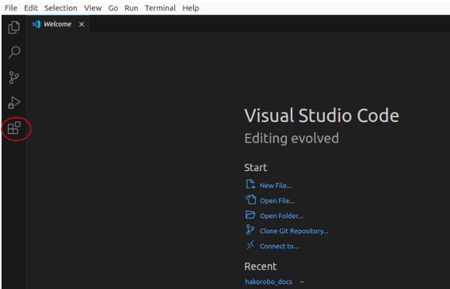

それをクリックしたら今回扱うVisual Studio Codeにおける追加機能を検索、インストールします。写真のように検索欄で検索してください。

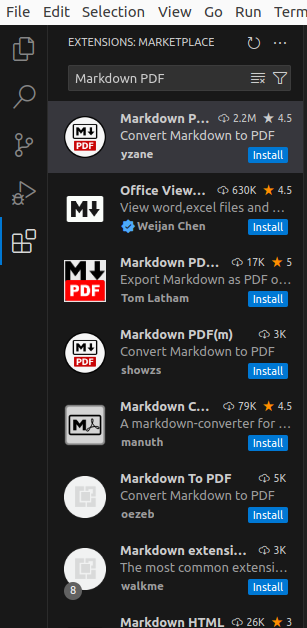

すると写真では１番上に今回インストールしたいものが出てきました。それをクリックしてみると...

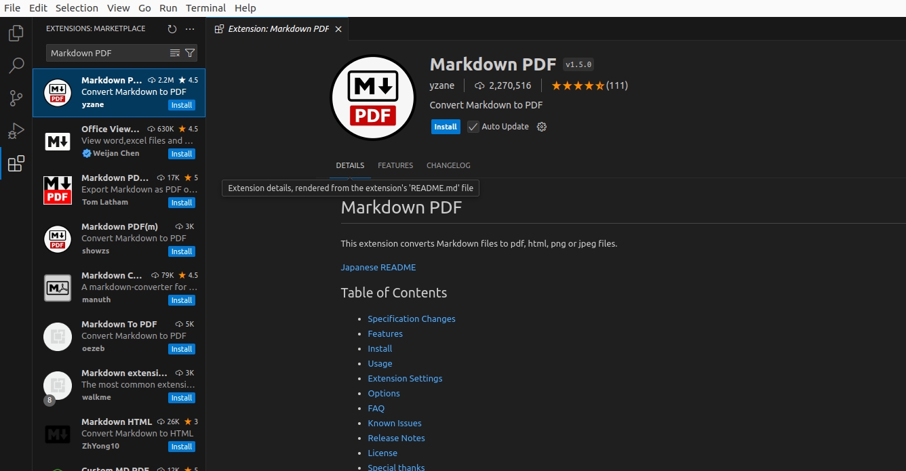

無事今回インストールしたい追加機能、ずばりエクステンションを見つけることができました。

写真のように「押せよ」と言わんばかりの**install**ボタンがあるので**install**ボタンを押して追加機能のインストールを完了しましょう。

## 実際につくってみる
それでは実際にマークダウンを記述し、それからPDFに変換する流れをやっていきましょう。
ここからはVisualStudioCodeを日本語版に変えてお伝えします。

### 保存先のフォルダを開く
まずはじめにVisualStudioCodeで今回つくるファイルが入るフォルダを開きましょう！
下の写真のように「フォルダーを開く」から今回のファイルの保存先を指定します。
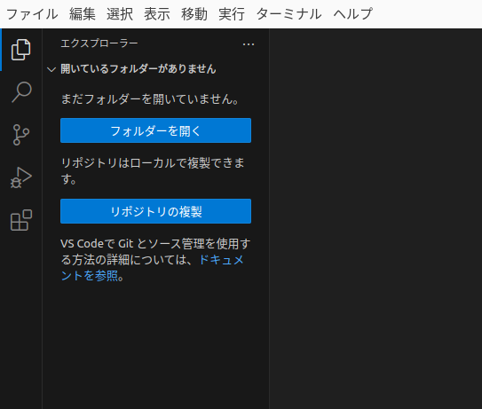

ここでは「test」という名前のフォルダを開きました。

### 新規ファイルを作成する
それではマークダウンファイルを作成します。以下の写真のように新規ファイルを作成しましょう。

***ここでファイル名に必ず「.md」を含めることを忘れないでください***

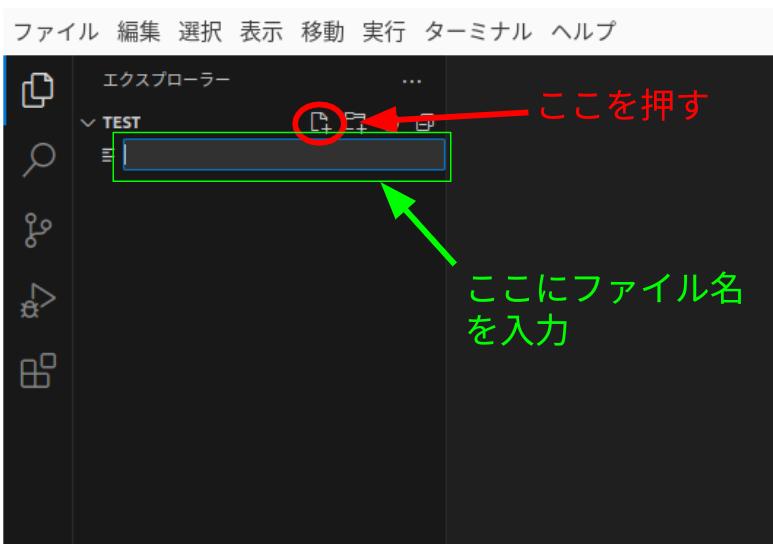

ここでは**test.md**を作成しました。

### マークダウンでタイトルを作成する
ここまででマークダウンファイルの作成をすることができました。ここから遂にマークダウン記法を用いた記述をしていきます。と言ってもここではとても初歩的な文章のみを紹介します。より詳しいマークダウン記法についてはブラウザ上で「**Markdown チートシート**」などと調べると日本語のガイドラインが見つかるはずです。

ここではPDFのタイトルとなるようなもののみ記述してみました。以下の写真を見てください。

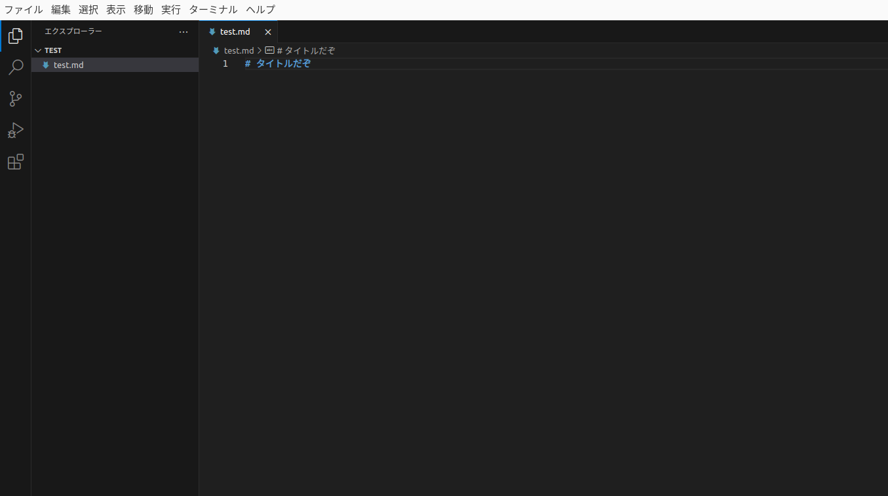

なんとマークダウン記法では「**#**」を書いてスペースを開けるだけでとても大きなタイトルとしてくれるのですね。しかし「このままではどのくらいの字の大きさになったのかわからない」という悩みが発生するはずです。

しかしVisualStudioCodeではその悩みがいっぱつで解決されます。以下の写真の位置にあるボタンを押してみましょう。

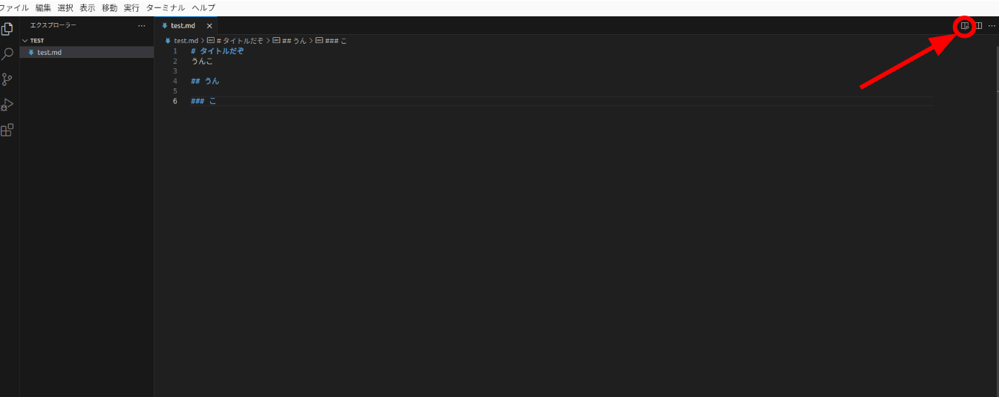

すると以下の写真のようにプレビューのようなものを映し出してくれるはずです。

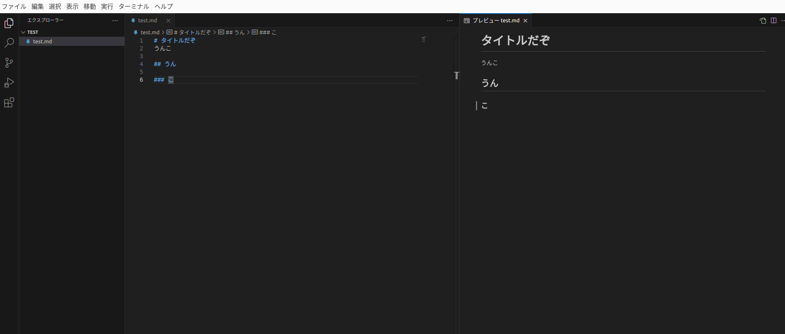

私は基本的にこのような画面の状態でマークダウン記法を作成しています。

## PDFへの変換
ついに最後、肝心なPDFへの変換です。ですが特段難しい操作があるというわけでもないのでサクッと終わらせましょう！

PDFに変換したいマークダウンファイルを開いている状態で右クリックを押してください。すると写真のような表示が見られるはずです。

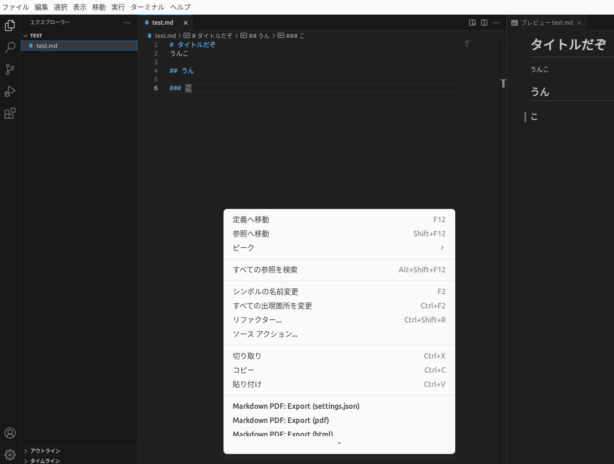

その表示をよくみると

#### Markdown PDF : Export(pdf)

というのがありました。これをクリックしてみましょう。

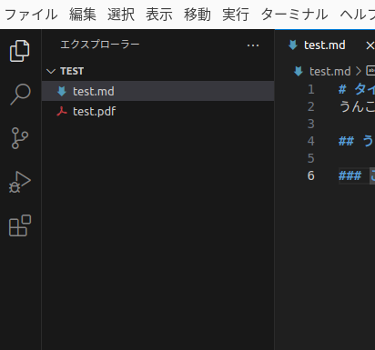

するとこのようにもとのマークダウンと同じ名前のPDFファイルが作成されるはずです。

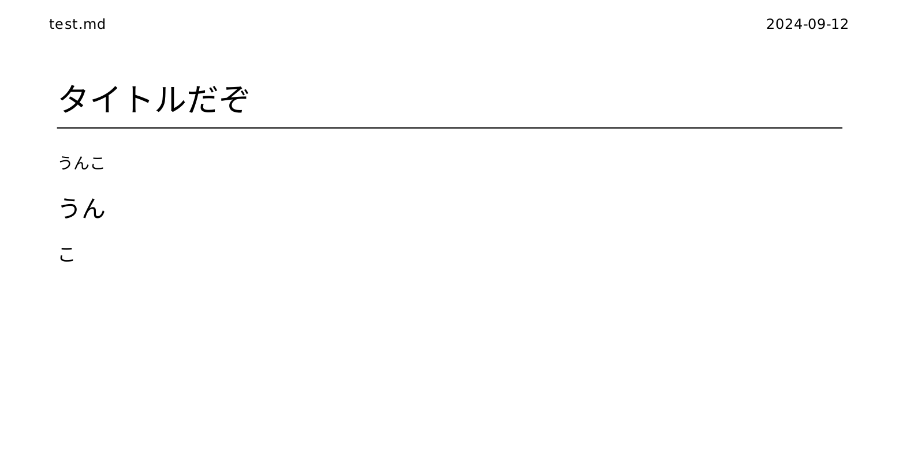

開いてみるともとのマークダウンファイルの名前、作成した日付とともにマークダウンプレビューでみていたようなPDFが表示されました。

## おわりに
今回は技術継承のいっかんとしてマークダウン記法したものをPDFに変換する手法を紹介しました。これが正解というわけではありませんが色々な方法で後輩に残していけたらなと思います。

こちらは2024年9/13に臼杵が執筆いたしました。
ここまで読んでいただきありがとうございました！